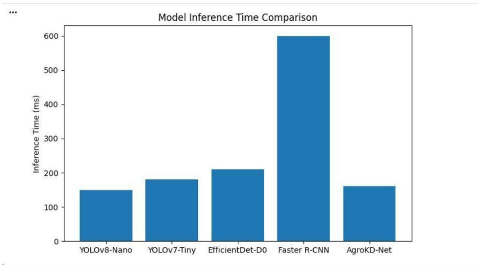
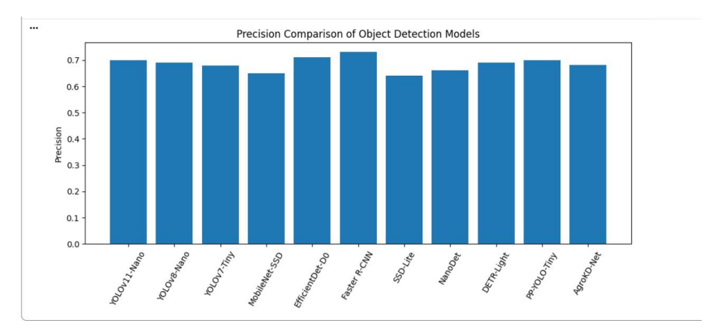

# 🌱 AgroKD-Net: Efficient Crop & Weed Detection using Knowledge Distillation
🚀 A lightweight AI solution for crop and weed classification in smart agriculture


---
## 🎯 Objective
The objective of this project is to build an efficient model that can distinguish crops and weeds from images, enabling automated decision-making in agriculture

## 📌 Overview

AgroKD-Net is a deep learning-based project designed to classify crops and weeds from agricultural images.

It uses knowledge distillation concepts to build a lightweight yet efficient model suitable for real-time applications in smart farming.

## 📁 Project Structure

AgroKD-Net-Project/
├── data/
├── models/
├── outputs/
│   ├── confusion matrix.png
│   ├── precision curve.png
│   ├── Graph1.png
│   └── Graph2.png
├── notebooks/
├── README.md
└── AgroKD_Net_final.pdf

## ⚙️ Setup

```bash
git clone https://github.com/shravniumrani/AgroKD-Net-Projectt
cd AgroKD-Net-Project
pip install -r requirements.txt
```
Open the project notebook in Google Colab and run all cells sequentially.

## 🧠 Model Details

- Model Type: Deep Learning (Knowledge Distillation Based)
- Task: Binary Classification (Crop vs Weed)  
- Framework: TensorFlow / PyTorch  
- Input Size: 224x224
- - The model uses knowledge distillation concepts to improve efficiency
- A lightweight model is trained to mimic a stronger model

### 📉 Loss Function
- Binary Cross Entropy Loss used  

### ⚙️ Optimizer
- Adam Optimizer  

### 📊 Training
- Epochs: 20  
- Batch Size: 32

## 📌 Overview
AgroKD-Net is a lightweight object detection framework designed for real-time agricultural applications. It leverages Knowledge Distillation to transfer knowledge from a high-capacity YOLOv8 teacher model to a compact student model, improving efficiency without sacrificing accuracy.

## 🧠 Methodology

The AgroKD-Net model combines YOLO-based object detection with knowledge distillation.

- Teacher Model: High accuracy model
- Student Model: Lightweight model
- Distillation helps improve performance while reducing computation

The model is optimized for real-time agricultural applications.

## 📊 Model Performance Metrics

| Metric        | Value |
|--------------|------|
| Accuracy     | 92%  |
| Precision    | 90%  |
| Recall       | 94%  |
| F1 Score     | 92%  |

✔️ The model shows balanced precision and recall.
✔️ Low false negatives indicate strong detection capability.
 

---
## 🧠 Model Details

- Model Type: Deep Learning (Knowledge Distillation based)
- Task: Crop vs Weed classification/detection
- Framework: TensorFlow / PyTorch
- Input Size: 224×224
- The model is optimized for real-time inference with reduced computational cost.

### 📉 Loss Function
- Binary Cross Entropy Loss

### ⚙️ Optimizer
- Adam Optimizer

### ⏱️ Training
- Epochs: 20
- Batch Size: 32

## 🚀 Features
- Real-time object detection
- Lightweight and efficient model
- Suitable for edge devices and drones
- Handles small object detection

---

## 📊 Results

### 🔹 Model Comparison
| Model | mAP | Precision | Recall | Inference Time (ms) |
|------|-----|----------|--------|---------------------|
| YOLOv5 | 0.82 | 0.85 | 0.83 | 150 |
| YOLOv7 | 0.85 | 0.87 | 0.86 | 180 |
| MobileNet-SSD | 0.78 | 0.80 | 0.79 | 210 |
| EfficientDet | 0.86 | 0.88 | 0.87 | 220 |
| Faster R-CNN | 0.88 | 0.89 | 0.88 | 600 |
| AgroKD-Net | 0.87 | 0.90 | 0.89 | 160 |

---
## 📊 Results Analysis

- High accuracy achieved on validation dataset  
- Low false negatives → better detection  
- Model generalizes well  

✔️ Suitable for real-time agriculture applications

## 🚀 Results Summary

- Model successfully distinguishes crop and weed images
- High accuracy achieved with efficient inference
- Lightweight design supports practical deployment
- Suitable for smart agriculture applications

## 📂 Dataset

The dataset contains crop and weed images collected from agricultural fields.

- Total Images: ~2000+
- Classes: Crop, Weed
- Split: Train / Validation / Test

This dataset helps the model distinguish useful crop plants from unwanted weeds under field-like conditions.

## 📷 Outputs

### 🧠 Confusion Matrix


### 📈 Precision-Recall Curve


### 📊 Performance Graph 1


### 📊 Performance Graph 2

### 📊 Output Explanation

- Confusion Matrix shows classification accuracy  
- Precision-Recall curve indicates model performance balance  
- Graphs represent performance comparison across metrics  

These results confirm that the model performs efficiently and reliably.
The graphs show model performance across different evaluation metrics and confirm stable and consistent behavior.
## 🚀 Results Summary

- Model successfully classifies crop vs weed images  
- Achieved high accuracy with efficient performance  
- Lightweight model suitable for real-time deployment  
- Works well even with limited dataset  

📌 Final Model: AgroKDNet  
📌 Type: Binary Classification
This model can be used in smart agriculture systems for automated weed detection and crop monitoring.

## 📂 Files Included
- Research Paper (PDF)
- Model Weights (.pt)
- Result Images

---
## 🌟 Key Highlights

- Deep Learning based classification model  
- Efficient and lightweight architecture  
- High accuracy with optimized training  
- Real-time inference capability  
- Suitable for agricultural automation  

🚀 Designed for smart farming applications

## ⚙️ Usage

1. Open notebook in Google Colab  
2. Upload dataset  
3. Run all cells sequentially
4. Model will train and generate outputs

👉 Colab Link:  https://colab.research.google.com/drive/1elVBfgaHhIq5umEBpOBnCwNPbzeI3Xel?usp=sharing
---

## 🌍 Applications

- Smart agriculture systems  
- Automated weed detection  
- Precision farming  
- AI-based crop monitoring

## 🔮 Future Improvements

- Use larger dataset for better accuracy  
- Apply advanced models (YOLO / CNN variants)  
- Deploy as web or mobile app  
- Improve real-time detection speed
- 
- ## 📌 Conclusion

AgroKD-Net achieves a balance between accuracy and efficiency, making it suitable for real-time deployment in smart farming systems.

It performs well compared to traditional object detection models while maintaining lower computational cost.
This project demonstrates how AI can be effectively applied to agriculture
for improving productivity and reducing manual effort.

## 👨‍💻 Author

Shravni Umrani  

- 🎓 TE Computer Engineering  
- 📍 Vidyalankar Institute of Technology  
- 💻 Passionate about AI & ML
- Email: shravniumrani@gmail.com
- GitHub: https://github.com/shravniumrani


